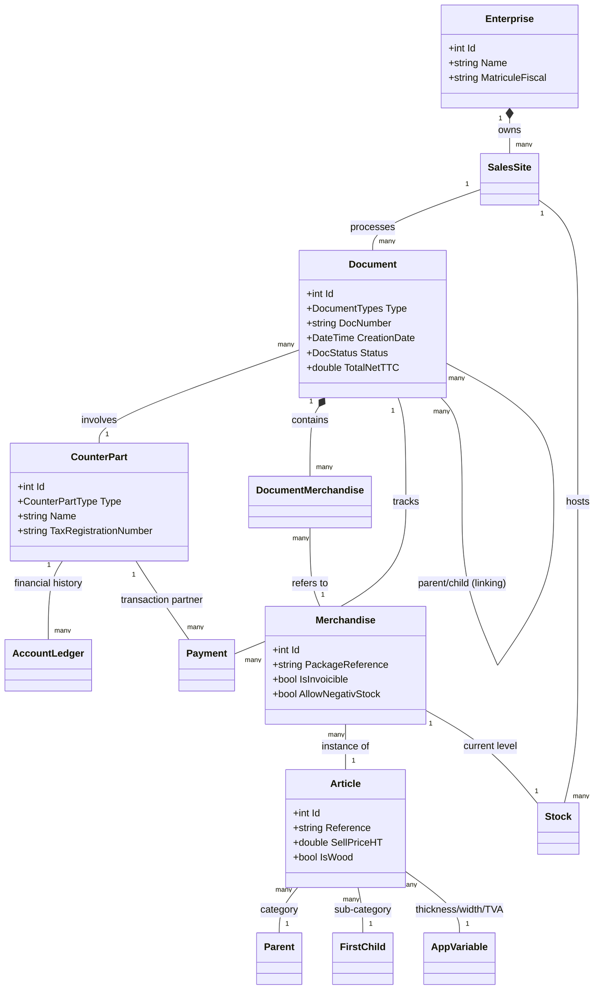

# 🌳 WoodApp Conceptual Architecture

This document describes the core entities and domain model of the **WoodApp ERP** system. 

## 🏗️ Entity Tree Structure

The domain entities are located in the `ms.webapp.api.acya.core/Entities` directory.

```text
Entities/
├── 🏢 Enterprise.cs              # Core enterprise configuration
├── 📍 SalesSite.cs               # Physical locations/warehouses
├── 👥 Person.cs                  # Base class for human entities
├── 👤 AppUser.cs                 # System users & authentication
├── 📋 CounterPart.cs             # Unified Business Partners (Clients/Providers)
├── 📦 Merchandise.cs             # Individual stock units (packages)
├── 📄 Document.cs                # Orders, Invoices, Delivery Notes
├── ⚖️ DocumentDocumentRelationship.cs # Parent-Child linking (e.g., Order -> Invoice)
├── 🧾 AccountLedger.cs           # Financial tracking
├── 🏦 Bank.cs                    # Banking details
├── 💰 Payment.cs                 # Payment transactions
├── 📦 Stock.cs                   # Inventory status
├── 🔄 StockMovement.cs           # Quantity changes (In/Out)
├── 🚛 Transporter.cs             # Logistic partners
├── 🏎️ Vehicle.cs                 # Fleet management
├── 🗂️ Categories/
│   ├── Parent.cs                 # High-level categories
│   ├── FirstChild.cs             # Sub-categories
│   └── SecondChild.cs            # Detailed sub-categories
├── 🛍️ Product/
│   ├── Article.cs                # Product definitions (Wood types, etc.)
│   ├── ListOfLength.cs           # Dimensional data for wood
│   ├── QuantityMovement.cs       # Item-specific tracking
│   └── SellPriceHistory.cs       # Pricing evolution
├── 👤 CustomerDependecies/
│   ├── Passenger.cs              # People associated with transport
│   ├── Transporter.cs            # Specific transport logic
│   └── Vehicle.cs                # Transport vehicles
├── ⏳ History/
│   ├── StockMovementHistory.cs   # Audit trail
│   └── QuantityMovementHistory.cs # Detailed item history
└── 🏥 AppHealth.cs               # System monitoring
```


---

## 📊 Domain Class Diagram



---

## 💎 Domain Entity Descriptions

### 🧱 Core Infrastructure
| Entity | Description |
| :--- | :--- |
| **Enterprise** | Central entity representing the company. Stores fiscal data (Matricule Fiscal), contact info, and global settings. |
| **SalesSite** | Represents physical sites or points of sale where stock is managed. Linked to an Enterprise. |
| **AppUser** | Authenticated users of the system. Tracks who created or updated records throughout the system. |
| **AppVariable** | Flexible configuration entity used for dynamic values like Taxes (TVA), Wood thicknesses, or Units. |

### 🤝 Business Ecosystem (CounterParts)
| Entity | Description |
| :--- | :--- |
| **CounterPart** | A unified entity representing any external entity interacting with the business (Customers, Providers, or both). |
| **Customer / Provider** | Specialized views or extended properties for the CounterPart entity. |
| **Transporter & Vehicle** | Manages logistics partners and their fleets for merchandise delivery. |

### 🪵 Products & Inventory
| Entity | Description |
| :--- | :--- |
| **Article** | Defines the "What". Represents a type of product (e.g., "Red Pine"). Stores base prices, dimensions, and categories. |
| **Merchandise** | Defines the "Instance". Represents a specific package or batch of an Article. Tracks invoicibility and individual stock properties. |
| **Stock & Movement** | Real-time tracking of quantities across Sites. **StockMovement** records the "In" and "Out" flows triggered by documents. |
| **Categories** | A hierarchical structure (Parent -> Child) to organize Articles for filtering and reporting. |

### 📑 Document Workflow
| Entity | Description |
| :--- | :--- |
| **Document** | The heart of the business logic. Handles multiple types: `supplierOrder`, `supplierReceipt`, `customerOrder`, `customerDeliveryNote`, `customerInvoice`. |
| **DocumentMerchandise** | Join entity representing lines within a document, linking Documents to specific Merchandise. |
| **DocDocumentRelationship** | Enables recursive linking between documents, allowing the system to track the lifecycle from a Quote to an Invoice. |

### 💸 Financial Management
| Entity | Description |
| :--- | :--- |
| **AccountLedger** | Tracks the balance and movement of funds for CounterParts. |
| **Payment** | Records actual monetary transactions (Cash, Check, Transfer) against Documents. |
| **HoldingTax (RS)** | Manages withholding tax ("Retenue à la Source") calculations required by fiscal regulations. |

---

> [!NOTE]
> This model follows a **Core-Centric** approach where `Document` and `CounterPart` act as the primary engines for both inventory movement and financial ledger updates.
