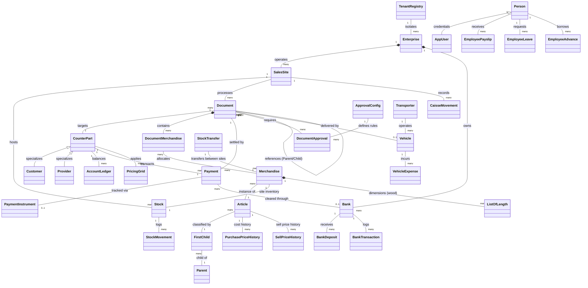

# 🌳 WoodApp Conceptual Architecture

This document describes the core entities and domain model of the **WoodApp ERP** system. 

## 🏗️ Entity Tree Structure

The domain entities are located in the `wood-app.api/src/ms.webapp.api.acya.core/Entities` directory.

```text
Entities/
├── 🏢 Enterprise.cs                   # Multi-tenant corporate entity configuration & fiscal info
├── 📍 SalesSite.cs                    # Physical points of sale, stores, and warehouses
├── 👥 Person.cs                       # Base entity for human profiles & staff
├── 👤 AppUser.cs                      # Authenticated system operators & role assignments
├── ⚙️ AppVariable.cs                  # Dynamic configuration parameters (Taxes, Wood dimensions)
├── 🌐 PlatformSetting.cs              # System-wide platform settings (e.g., RNE registration rules)
├── 🏢 TenantRegistry.cs               # Multi-tenant database routing & schema registry
├── 📋 CounterPart.cs                  # Unified commercial partner entity (Customers & Suppliers)
├── 👤 Customer.cs                     # Dedicated customer profile specialization
├── 🏭 Provider.cs                     # Dedicated supplier profile specialization
├── 🛍️ Merchandise.cs                  # Physical batch/package instances of articles
├── 📄 Document.cs                     # Commercial documents (Orders, Delivery Notes, Invoices)
├── 📝 DocumentMerchandise.cs          # Line items linking Documents to Merchandise batches
├── ⚖️ DocumentDocumentRelationship.cs  # Recursive document lifecycle linkage (Quote -> BL -> Invoice)
├── ✅ DocumentApproval.cs              # Multi-tier approval instances on documents
├── ⚙️ ApprovalConfig.cs               # Thresholds and rule configuration for document approvals
├── 🏷️ PricingGrid.cs                  # Specialized customer/category pricing rules
├── 📦 Stock.cs                        # Real-time stock levels per site and merchandise
├── 🔄 StockMovement.cs                # Quantified movements (Inflows, Outflows, Adjustments)
├── 🔀 StockTransfer.cs                # Inter-site warehouse transfers & dispatch validation
├── 🧾 AccountLedger.cs                # Customer & Supplier balance ledgers
├── 🏦 Bank.cs                         # Enterprise bank accounts
├── 📥 BankDeposit.cs                  # Bank deposit bordereaux (checks/cash into bank)
├── 🏧 BankTransaction.cs              # Direct bank operations & account reconciliations
├── 💵 CaisseMovement.cs               # Cash drawer / register transactions and float movements
├── 💰 Payment.cs                      # Cash, check, transfer settlement records
├── 📑 PaymentInstrument.cs            # Check and promissory note lifecycle tracking
├── 📜 HoldingTax.cs                   # Fiscal withholding tax (Retenue à la Source - RS)
├── 🚛 Transporter.cs                  # Logistic & shipping partners
├── 🏎️ Vehicle.cs                      # Transport fleet and logistics vehicles
├── ⛽ VehicleExpense.cs               # Fleet operational expenses (fuel, maintenance, repairs)
├── 💼 EmployeeAdvance.cs              # HR salary advances (Acomptes sur salaire)
├── 🏖️ EmployeeLeave.cs                # HR employee leave and absence records
├── 📑 EmployeePayslip.cs              # HR monthly salary payslips and deductions
├── 🛡️ AuditLog.cs                     # Granular system-wide audit trail for entity mutations
├── 🏥 AppHealth.cs                    # System monitoring & health status
├── 🗂️ Categories/
│   ├── Parent.cs                      # Top-level category definitions
│   ├── FirstChild.cs                  # Primary sub-categories
│   └── SecondChild.cs                 # Secondary granular sub-categories
├── 🛍️ Product/
│   ├── Article.cs                     # Master product definitions (Wood species, dimensions)
│   ├── ListOfLength.cs                # Dimensional lengths & piece counts for wood packages
│   ├── QuantityMovement.cs            # Granular piece/length movement ledger
│   ├── SellPriceHistory.cs            # Historical selling price changes
│   ├── SalesPriceHistory.cs           # Target sales price evolutions
│   └── PurchasePriceHistory.cs        # Supplier purchase cost tracking
├── 👤 CustomerDependecies/
│   ├── Passenger.cs                   # Transport passenger manifests
│   ├── Transporter.cs                 # Specific transport contacts
│   └── Vehicle.cs                     # Customer-assigned delivery vehicles
├── ⏳ History/
│   ├── StockMovementHistory.cs        # Historical stock state snapshots
│   ├── QuantityMovementHistory.cs     # Historical length/package item changes
│   └── ListOfLengthHistory.cs         # Audit snapshots for dimensional changes
└── 🔔 Notifications/
    └── AppNotification.cs             # In-app alerts, stock warnings, and task notifications
```

---

## 📊 Domain Class Diagram


```mermaid
classDiagram
    %% Core Multi-Tenancy & Infrastructure
    TenantRegistry "1" -- "many" Enterprise : isolates
    Enterprise "1" *-- "many" SalesSite : operates
    Enterprise "1" *-- "many" Bank : owns
    SalesSite "1" -- "many" Stock : hosts
    SalesSite "1" -- "many" Document : processes
    SalesSite "1" -- "many" CaisseMovement : records

    %% Commercial Partners
    CounterPart <|-- Customer : specializes
    CounterPart <|-- Provider : specializes
    CounterPart "1" -- "many" AccountLedger : balances
    CounterPart "1" -- "many" Payment : transacts
    CounterPart "1" -- "many" PricingGrid : applies

    %% Documents & Workflow
    Document "many" -- "1" CounterPart : targets
    Document "1" *-- "many" DocumentMerchandise : contains
    Document "1" -- "many" Payment : settled by
    Document "1" -- "many" DocumentApproval : requires
    Document "many" -- "many" Document : references (Parent/Child)
    ApprovalConfig "1" -- "many" DocumentApproval : defines rules

    %% Stock & Merchandises
    DocumentMerchandise "many" -- "1" Merchandise : allocates
    Merchandise "many" -- "1" Article : instance of
    Merchandise "1" -- "1" Stock : site inventory
    Merchandise "1" *-- "many" ListOfLength : dimensions (wood)
    Stock "1" -- "many" StockMovement : logs
    StockTransfer "1" -- "many" Merchandise : transfers between sites

    %% Catalog & Categorization
    Article "many" -- "1" FirstChild : classified by
    FirstChild "many" -- "1" Parent : child of
    Article "1" -- "many" PurchasePriceHistory : cost history
    Article "1" -- "many" SellPriceHistory : sell price history

    %% Treasury & Banking
    Payment "1" -- "0..1" PaymentInstrument : tracked via
    Payment "many" -- "0..1" Bank : cleared through
    Bank "1" -- "many" BankDeposit : receives
    Bank "1" -- "many" BankTransaction : logs

    %% HR
    Person <|-- AppUser : credentials
    Person "1" -- "many" EmployeePayslip : receives
    Person "1" -- "many" EmployeeLeave : requests
    Person "1" -- "many" EmployeeAdvance : borrows

    %% Fleet & Logistics
    Transporter "1" -- "many" Vehicle : operates
    Vehicle "1" -- "many" VehicleExpense : incurs
    Document "many" -- "0..1" Vehicle : delivered by
```

---

## 💎 Domain Entity Descriptions

### 🧱 Core Infrastructure & Multi-Tenancy
| Entity | Description |
| :--- | :--- |
| **Enterprise** | Central corporate tenant entity. Stores fiscal identification (Matricule Fiscal, RNE), business contacts, and global tenant configurations. |
| **SalesSite** | Represents physical warehouses, lumber yards, or points of sale where stock and registers are operated. |
| **TenantRegistry** | Controls dynamic multi-tenancy and database schema resolution for isolating tenant data. |
| **PlatformSetting** | Global application and governance settings (e.g. required RNE documentation, system onboarding parameters). |
| **AppUser** | Authenticated operators, role assignments, and audit attribution across all mutations. |
| **AppVariable** | Dynamic configuration parameters for taxes (TVA), timber thickness/width standards, and conversion units. |
| **AppHealth** | Service health status and database connectivity monitoring. |

### 🤝 Business Partners (CounterParts)
| Entity | Description |
| :--- | :--- |
| **CounterPart** | Unified partner entity representing customers, suppliers, or mixed commercial entities. Holds fiscal registry, credit limits, and addresses. |
| **Customer / Provider** | Entity views and specialized extensions built on top of `CounterPart` for targeted workflows. |
| **PricingGrid** | Customer-specific or partner-tier pricing rules, volume discounts, and negotiated rates. |

### 🪵 Products & Catalog
| Entity | Description |
| :--- | :--- |
| **Article** | Master catalog definition for lumber and hardware items. Holds wood species, standard dimensions, unit metrics, and tax codes. |
| **Categories (Parent, FirstChild, SecondChild)** | 3-tier taxonomy for classifying lumber, building materials, and wood products. |
| **ListOfLength** | Granular dimensional breakdown (lengths, piece counts, and total m³/m²) specific to timber packages. |
| **Price Histories** | Detailed audit logs for product pricing: `PurchasePriceHistory` (supplier costs), `SalesPriceHistory`, and `SellPriceHistory`. |

### 📦 Inventory & Stock Logistics
| Entity | Description |
| :--- | :--- |
| **Merchandise** | Physical batch/package instance of an `Article`. Identifies barcode/package reference, invoicibility, and negative-stock tolerances. |
| **Stock** | Aggregated inventory level of an article/merchandise per `SalesSite`. |
| **StockMovement** | Transactional ledger recording all inflows, outflows, and adjustments driven by documents or manual reconciliations. |
| **StockTransfer** | Inter-warehouse dispatch management: tracks pending, in-transit, and received stock transfers between sites. |
| **QuantityMovement & History** | Piece-level length ledger and historical audit snapshots for timber packages. |

### 📑 Commercial Documents & Approval Workflows
| Entity | Description |
| :--- | :--- |
| **Document** | Commercial document engine handling Quotes, Customer/Supplier Orders, Delivery Notes (BL), Reception Notes, and Invoices. |
| **DocumentMerchandise** | Document item lines binding specific Merchandise batches with quantities, discounts, and applied taxes. |
| **DocumentDocumentRelationship** | Recursive linking engine connecting document lifecycles (e.g., Quotation → Order → Delivery Note → Invoice). |
| **DocumentApproval & ApprovalConfig** | Configurable validation workflows with thresholds requiring manager sign-off prior to validation or fulfillment. |

### 💸 Treasury, Banking & Financial Ledger
| Entity | Description |
| :--- | :--- |
| **AccountLedger** | Chronological financial balance and accounting entries for each `CounterPart`. |
| **Payment** | Settlement transaction records linked to documents or partner accounts. |
| **PaymentInstrument** | Comprehensive lifecycle management for checks, bank drafts, and promissory notes (received, deposited, cleared, rejected). |
| **Bank, BankDeposit & BankTransaction** | Bank account management, deposit slip reconciliation (bordereaux de remise), and bank statement entries. |
| **CaisseMovement** | Physical cash drawer tracking: opening float, daily receipts, cash disbursements, and closing balances. |
| **HoldingTax (RS)** | Fiscal withholding tax ("Retenue à la Source") calculations and certificates per fiscal regulations. |

### 🚛 Fleet & Logistics
| Entity | Description |
| :--- | :--- |
| **Transporter** | External transport contractors and internal logistics drivers. |
| **Vehicle** | Fleet vehicle management (trucks, utility vans) with registration details and carrying capacities. |
| **VehicleExpense** | Operational cost tracking per vehicle (fuel, vignettes, maintenance, repairs, and insurance). |
| **CustomerDependencies (Passenger, Transporter, Vehicle)** | Operational assignments linking transport agents, vehicles, and delivery passengers to shipments. |

### 👥 Human Resources & Payroll
| Entity | Description |
| :--- | :--- |
| **Person** | Base human resource model storing identity, contact details, and employment metadata. |
| **EmployeeAdvance** | Tracking salary advances (acomptes) and their recovery schedules. |
| **EmployeeLeave** | Paid time off, medical leave, and absence authorizations. |
| **EmployeePayslip** | Monthly payroll records including base pay, bonuses, social contributions, and net payable calculations. |

### 🔔 Notifications & Auditing
| Entity | Description |
| :--- | :--- |
| **AppNotification** | System notifications, low-stock warnings, approval alerts, and broadcast announcements. |
| **AuditLog** | Comprehensive audit trail logging user actions, timestamped changes, and changed values across core models. |

---

> [!NOTE]
> This model follows a **Core-Centric** and **Tenant-Aware** architecture where `Enterprise` and `SalesSite` partition operations, while `Document`, `Stock`, and `AccountLedger` serve as the transactional engines for merchandise movements and financial flows.
